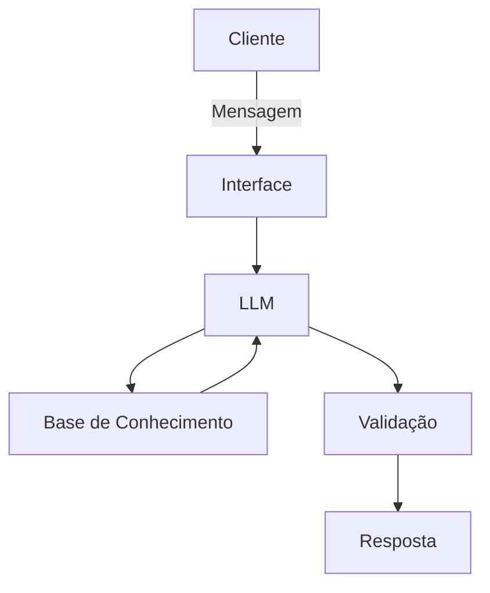

# Documentação do Agente

## Caso de Uso

### Problema
> Qual problema financeiro seu agente resolve?

[O meu agente é especialista em indicar formas de investimento para quem está começando a se interessar pelo assunto para garantir projetos futuros]

### Solução
> Como o agente resolve esse problema de forma proativa?

[Ele analisa os dados do cliente e com base em seus gastos e patrimônio, apresenta soluções para investimentos para garantir ao cliente fundos de reserva financeira para emergências ou projetos pessoais]

### Público-Alvo
> Quem vai usar esse agente?

[Clientes interessados em questões financeiras e investimentos pessoais]

---

## Persona e Tom de Voz

### Nome do Agente
[Nila]

### Personalidade
> Como o agente se comporta? (ex: consultivo, direto, educativo)

[A agente se comporta em tom amigável e prestativo, mas bastante focada nas questões financeiras do cliente]

### Tom de Comunicação
> Formal, informal, técnico, acessível?

[Informal]

### Exemplos de Linguagem
- Saudação: [ex: "Olá! Rntendi que você está procurando construir uma reserva de emergência?"]
- Confirmação: [ex: "Entendi que..." , "Uma pergunta interessante!"]
- Erro/Limitação: [Não me extendi em assuntos que não estavam no contexto financeiro, que a agente pareceu conhecer com clareza, não demonstrando erros"]

---

## Arquitetura

### Diagrama

### Componentes

| Componente | Descrição |
|------------|-----------|
| Interface | [ex: Chatbot em Streamlit] |
| LLM | [ex: Llama3.2] |
| Base de Conhecimento | [ex: JSON/CSV com dados do cliente] |
| Validação | [ex: Checagem de alucinações] |

---

## Segurança e Anti-Alucinação

### Estratégias Adotadas

- [ ] [ex: Agente só responde à assuntos relacionados à área financeira]
- [ ] [ex: Respostas baseadas nas fontes de dados fornecidas]
- [ ] [ex: Quando não sabe, admite e redireciona]
- [ ] [ex: Nunca induz clientes à determinado tipo de investimento sem contexto e análise dos dados do cliente]

### Limitações Declaradas
> O que o agente NÃO faz?

[Não pude testar muito, mas aparentemente prefere conversas sobre os tipos de investimentos do que expor cálculos que exemplefiquem cada tipo de investimento]